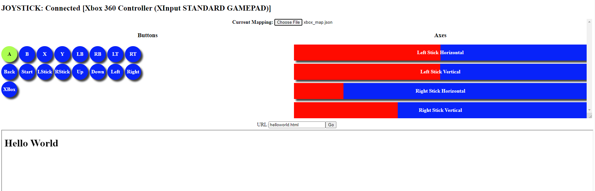

# GamepadDebugPage
## A Single-Page HTML/Javascript utility for Debugging a connected Gamepad

Utiltiy with XBox Controller connected, mapping loaded, and a local webpage loaded in the iframe

&nbsp;

# Usage
* Open webpage in browser
* If not already connected, connect gamepad
  * If gamepad is connected and not visible, you may need to press a button or move an axis; idle gamepads often do not register until they are first used on a page, per the specs.
* All buttons and axes the gamepad recognizes will be shown and the vendor name of the controller will be shown if provided
    * For some generic gamepads, extra buttons/axes may be shown (reason unknown)
    * *After* the gamepad is visible on the page, you can load a mapping to apply labels to the buttons and axes
    * The HUD will update to show button presses and axis movement as they happen
* At the bottom of the screen is an iframe which can be used to display a webpage for further testing using the provided text input
    * Some sites do not allow embedding in iframes
    * Local files can be accessed via name

# Mapping files
A mapping file is a JSON file.

It currently does not limit the specific contents (i.e.- you could include entries such as name, description, extra info, etc.), but the load function will check for the "buttons" and "axes" entries. These should be arrays of strings. Each string will be paired with it's same index on the HUD for the appropriate widget (e.x.- mapping.buttons[0] should be a string that will be applied to GUI_BUTTONS.getElementsByClassName("button")[0]).

Each time a mapping is (successfully) loaded, all labels are removed. If there are not enough labels for all widgets on the HUD, the remainder will be left blank. If there are more labels than there are widgets, extra labels will be ignored.